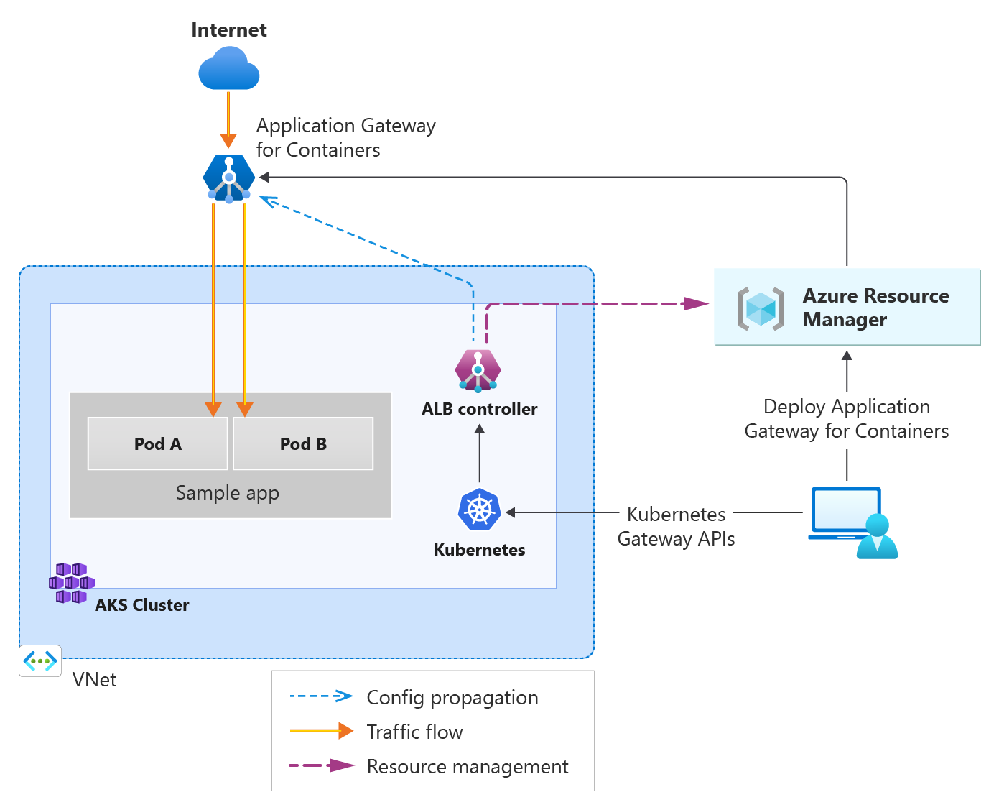

# Deploy Application Gateway for Containers ALB controller

This repository contains the documentation and samples for deploying the Application Gateway for Containers ALB controller. The Application Gateway for Containers ALB controller is a Kubernetes ingress controller that uses the Azure Application Gateway to expose services outside the Kubernetes cluster. The Application Gateway for Containers ALB controller is built on top of the [Kubernetes Gateway API](https://gateway-api.sigs.k8s.io/).



Documentation for the Application Gateway for Containers ALB controller can be found here:
<https://learn.microsoft.com/en-us/azure/application-gateway/for-containers/>

## create a new AKS cluster with Azure CNI and workload identity enabled

```bash
AKS_NAME='<name of aks cluster>'
RESOURCE_GROUP='<name of resource group>'
LOCATION='northeurope' # The list of available regions may grow as we roll out to more preview regions

az group create --name $RESOURCE_GROUP --location $LOCATION
az aks create --resource-group $RESOURCE_GROUP --name $AKS_NAME --location $LOCATION --os-sku AzureLinux --network-plugin azure --enable-oidc-issuer --enable-workload-identity --generate-ssh-key
```

## create workload identity and install the ALB Controller

Create a user managed identity for ALB controller and federate the identity as Workload Identity to use in the AKS cluster.

### Create workload identity

```bash

IDENTITY_RESOURCE_NAME='azure-alb-identity'

mcResourceGroup=$(az aks show --resource-group $RESOURCE_GROUP --name $AKS_NAME --query "nodeResourceGroup" -o tsv)
mcResourceGroupId=$(az group show --name $mcResourceGroup --query id -otsv)

echo "Creating identity $IDENTITY_RESOURCE_NAME in resource group $RESOURCE_GROUP"
az identity create --resource-group $RESOURCE_GROUP --name $IDENTITY_RESOURCE_NAME
principalId="$(az identity show -g $RESOURCE_GROUP -n $IDENTITY_RESOURCE_NAME --query principalId -otsv)"

echo "Waiting 60 seconds to allow for replication of the identity..."
sleep 60

echo "Apply Reader role to the AKS managed cluster resource group for the newly provisioned identity"
az role assignment create --assignee-object-id $principalId --assignee-principal-type ServicePrincipal --scope $mcResourceGroupId --role "acdd72a7-3385-48ef-bd42-f606fba81ae7" # Reader role

echo "Set up federation with AKS OIDC issuer"
AKS_OIDC_ISSUER="$(az aks show -n "$AKS_NAME" -g "$RESOURCE_GROUP" --query "oidcIssuerProfile.issuerUrl" -o tsv)"
az identity federated-credential create --name "azure-alb-identity" \
    --identity-name "$IDENTITY_RESOURCE_NAME" \
    --resource-group $RESOURCE_GROUP \
    --issuer "$AKS_OIDC_ISSUER" \
    --subject "system:serviceaccount:alb-system:alb-controller-sa"

```

### Install the ALB Controller

```bash
az aks get-credentials --resource-group $RESOURCE_GROUP --name $AKS_NAME
helm install alb-controller oci://mcr.microsoft.com/application-lb/charts/alb-controller --namespace alb-system --create-namespace  --version 0.6.1 --set albController.namespace=alb-system --set albController.podIdentity.clientID=$(az identity show -g $RESOURCE_GROUP -n azure-alb-identity --query clientId -o tsv)
```

#### Verify the ALB Controller installation

Verify the ALB Controller pods are ready:

```bash
kubectl get pods -n alb-system
```

#### Verify gateway class

Verify GatewayClass azure-application-lb is installed on your cluster:

```bash
kubectl get gatewayclass azure-alb-external -o yaml
```

You should see that the GatewayClass has a condition that reads Valid GatewayClass.

## Prepare your virtual network / subnet for Application Gateway for Containers

If you don't have a subnet available with at least 250 available IP addresses and delegated to the Application Gateway for Containers resource, use the following steps to create a new subnet and enable subnet delegation. 

```bash
CLUSTER_SUBNET_ID=$(az vmss list --resource-group $mcResourceGroup --query '[0].virtualMachineProfile.networkProfile.networkInterfaceConfigurations[0].ipConfigurations[0].subnet.id' -o tsv)
read -d '' VNET_NAME VNET_RESOURCE_GROUP VNET_ID <<< $(az network vnet show --ids $CLUSTER_SUBNET_ID --query '[name, resourceGroup, id]' -o tsv)

SUBNET_ADDRESS_PREFIX='10.225.0.0/24'    #'<network address and prefix for an address space under the vnet that has at least 250 available addresses (/24 or larger subnet)>'
ALB_SUBNET_NAME='subnet-alb' # subnet name can be any non-reserved subnet name (i.e. GatewaySubnet, AzureFirewallSubnet, AzureBastionSubnet would all be invalid)
az network vnet subnet create --resource-group $VNET_RESOURCE_GROUP --vnet-name $VNET_NAME --name $ALB_SUBNET_NAME --address-prefixes $SUBNET_ADDRESS_PREFIX --delegations 'Microsoft.ServiceNetworking/trafficControllers'
ALB_SUBNET_ID=$(az network vnet subnet show --name $ALB_SUBNET_NAME --resource-group $VNET_RESOURCE_GROUP --vnet-name $VNET_NAME --query '[id]' --output tsv)
```

### Delegate permissions to managed identity

ALB Controller needs the ability to provision new Application Gateway for Containers resources and to join the subnet intended for the Application Gateway for Containers association resource.

```bash
# Delegate AppGw for Containers Configuration Manager role to AKS Managed Cluster RG
az role assignment create --assignee-object-id $principalId --assignee-principal-type ServicePrincipal --scope $mcResourceGroupId --role "fbc52c3f-28ad-4303-a892-8a056630b8f1"

# Delegate Network Contributor permission for join to association subnet
az role assignment create --assignee-object-id $principalId --assignee-principal-type ServicePrincipal --scope $ALB_SUBNET_ID --role "4d97b98b-1d4f-4787-a291-c67834d212e7"
```

## Create ApplicationLoadBalancer Kubernetes resource

Define the Kubernetes namespace for the ApplicationLoadBalancer resource.

```bash
kubectl apply -f alb-namespace.yaml
```

create the Application Gateway for Containers resource and association

```bash

cat applicationloadbalancer.yaml | ALB_SUBNET_ID=$ALB_SUBNET_ID envsubst | kubectl apply -f -
```

or

```bash
kubectl apply -f - <<EOF
apiVersion: alb.networking.azure.io/v1
kind: ApplicationLoadBalancer
metadata:
  name: alb-test
  namespace: alb-test-infra
spec:
  associations:
  - $ALB_SUBNET_ID
EOF
```

#### Validate creation of the Application Gateway for Containers resources

Once the ApplicationLoadBalancer resource has been created, you can track deployment progress of the Application Gateway for Containers resources. The deployment transitions from InProgress to Programmed state when provisioning has completed. It can take 5-6 minutes for the Application Gateway for Containers resources to be created.

```bash
kubectl get applicationloadbalancer alb-test -n alb-test-infra -o yaml -w
```

## Scenarios / sample applications

How-to guides to deploy a sample application, demonstrating some of Application Gateway for Container's load balancing concept:

* Mutual TLS with Application Gateway for Containers: [backend-mtls](./backend-mtls/backend-mtls.md)
* SSL offloading with Application Gateway for Containers : [ssl-offloading](./ssl-offloading/ssl-offloading.md)
* Traffic splitting with Application Gateway for Containers : [traffic-splitting](./traffic-splitting/traffic-splitting.md)
