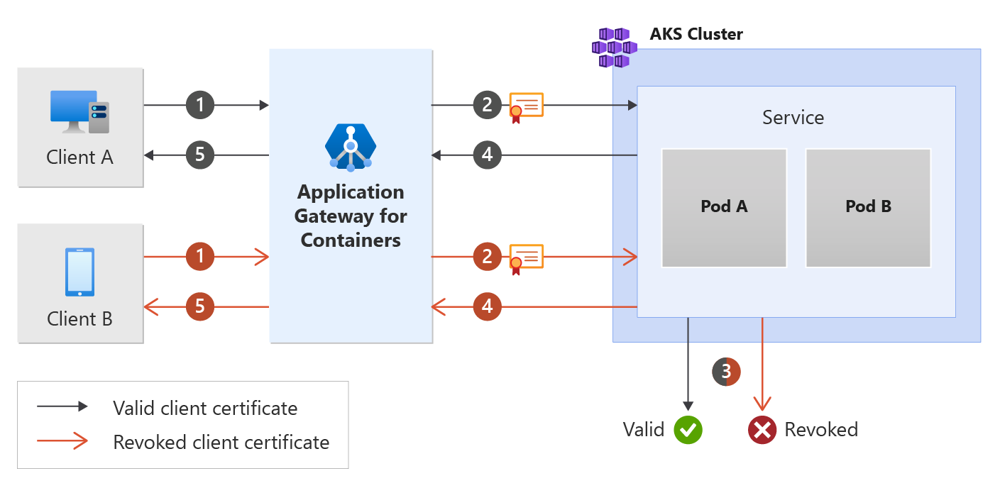

# Backend MTLS with Application Gateway for Containers

Mutual Transport Layer Security (MTLS) is a process that relies on certificates to encrypt communications and identify clients to a service. This enables backend workloads to further increase its security posture by only trusting connections from authenticated devices.



## Deploy sample application

```bash
kubectl apply -f backend-mtls.yaml
```

This creates the following:

* a namespace called test-mtls
* one service called mtls-app in the test-mtls namespace
* one deployment called mtls-app in the test-mtls namespace
* one config map called mtls-app-nginx-cm in the test-mtls namespace
* four secrets called backend.com, frontend.com, gateway-client-cert, and ca.bundle in the test-mtls namespace

### Deploy the required Gateway API resources

```bash
kubectl apply -f backend-mtls-gateway.yaml
```

Once the gateway resource has been created, ensure the status is valid, the listener is Programmed, and an address is assigned to the gateway

```bash
kubectl get gateway gateway-01 -n test-mtls -o yaml
```

create an HTTPRoute

```bash
kubectl apply -f backend-mtls-httproute.yaml
```

Once the HTTPRoute resource has been created, ensure the route has been Accepted and the Application Gateway for Containers resource has been Programmed.

```bash
kubectl get httproute https-route -n test-mtls -o yaml
```

Create a BackendTLSPolicy

```bash
kubectl apply -f backend-mtls-tlspolicy.yaml
```

Once the BackendTLSPolicy object has been created check the status on the object to ensure that the policy is valid

```bash
kubectl get backendtlspolicy -n test-mtls mtls-app-tls-policy -o yaml
```

Test access to the application

```bash
fqdn=$(kubectl get gateway gateway-01 -n test-mtls -o jsonpath='{.status.addresses[0].value}')
curl --insecure https://$fqdn/
```

## Cleanup

```bash
kubectl delete -f backend-mtls.yaml
```
