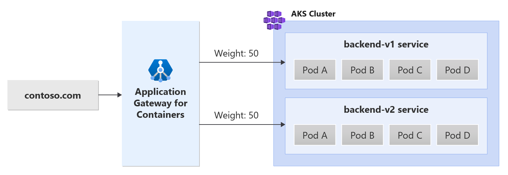

# Traffic splitting with Application Gateway for Containers

Application Gateway for Containers enables you to set weights and shift traffic between different backend targets. See the following example scenario:



Deploy sample application

```bash
kubectl apply -f traffic-splitting.yaml
```

This command creates the following on your cluster:

* a namespace called test-trafficsplitting
* two services called backend-v1 and backend-v2 in the test-trafficsplitting namespace
* two deployments called backend-v1 and backend-v2 in the test-trafficsplitting namespace

## Deploy the required Gateway API resources

```bash
kubectl apply -f traffic-splitting-gateway.yaml
```

Verify the status of the gateway resource, ensure the status is valid, the listener is Programmed, and an address is assigned to the gateway

```bash
kubectl get gateway gateway-01 -n test-trafficsplitting -o yaml
```

Once the gateway has been created, create an HTTPRoute

```bash
kubectl apply -f traffic-splitting-httproute.yaml
```

Once the HTTPRoute resource has been created, ensure the route has been Accepted and the Application Gateway for Containers resource has been Programmed.

```bash
kubectl get httproute traffic-split-route -n test-trafficsplitting -o yaml
```

Test Access to the Application

```bash
fqdn=$(kubectl get gateway gateway-01 -n test-trafficsplitting -o jsonpath='{.status.addresses[0].value}')
# this curl command will return 50% of the responses from backend-v1
# and the remaining 50% of the responses from backend-v2
watch -n 1 curl http://$fqdn
```

## Clean up

```bash
kubectl delete -f traffic-splitting.yaml
```
